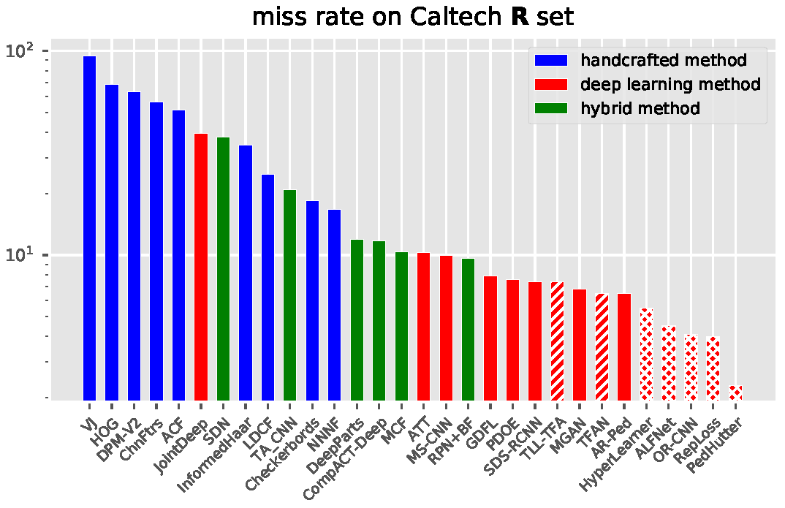
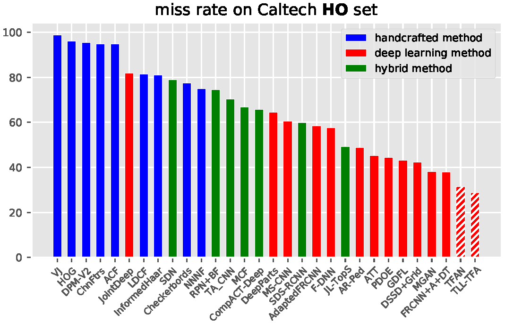
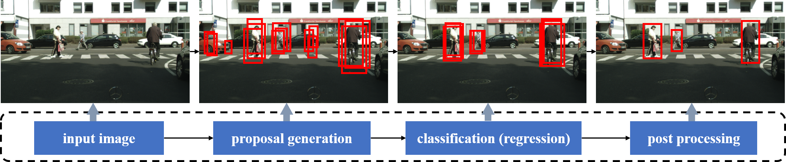

## From Handcrafted to Deep Features for Pedestrian Detection: A Survey

This project provides a paper list about pedestrian detection following the taxonomy in "*[From Handcrafted to Deep Features for Pedestrian Detection: A Survey
(IEEE TPAMI 2021)](https://arxiv.org/pdf/2010.00456.pdf)*". 
- **Single-spectral pedestrian detection** and **multispectral pedestrian detection** are both summarized.
- The performance of some methods on different datasets are shown in [Leaderboard](Comparison.md).
- We release a **new pedestrian detection dataset** ([TJU-DHD-Pedestrian, IEEE TIP](https://arxiv.org/pdf/2011.09170.pdf)) .
- If you find a new paper or an error, please feel free to contact us.  

<table>
    <tr>
        <td ><center> </center></td>
        <td ><center> </center></td>
    </tr>
</table>
<table>
    <tr>
        <td ><center> </center></td>
    </tr>
</table>

## News
- [April 16, 2021]: ArXiv: [LLA](https://arxiv.org/pdf/2101.04307.pdf), [Box Re-Ranking](https://arxiv.org/pdf/2102.00595.pdf), [V2F-Net](https://arxiv.org/pdf/2104.03106.pdf)
- [Mar. 19, 2021]: ArXiv: [DRNet ](https://arxiv.org/pdf/2103.10091.pdf)
- [Jan. 07, 2021]: ArXiv: [DETR for Pedestrian Detection](https://arxiv.org/abs/2012.06785)
- [Dec. 05, 2020]: Trans. or Conf.: [KGSNet](https://ieeexplore.ieee.org/document/9137724), [SSAM](https://ieeexplore.ieee.org/document/9186837), [SSD-MR](https://ieeexplore.ieee.org/stamp/stamp.jsp?tp=&arnumber=9197399), [MGAN](https://ieeexplore.ieee.org/document/9282190), [PEN](https://ieeexplore.ieee.org/stamp/stamp.jsp?tp=&arnumber=9109304), [ADGN](https://ieeexplore.ieee.org/document/9145843), [RSA-YOLO](https://ieeexplore.ieee.org/document/9272650), [CWETM](https://ieeexplore.ieee.org/document/9050835), [PLM](https://ieeexplore.ieee.org/document/8701617), [GRPN](https://ieeexplore.ieee.org/stamp/stamp.jsp?tp=&arnumber=9091903)
- [Nov. 19, 2020]: A newly built deverse pedestrian detection dataset ([TJU-DHD-Pedestrian](https://arxiv.org/pdf/2011.09170.pdf)) 
- [Nov. 05, 2020]: WACV2021 methods ([TinyCityPersons](https://arxiv.org/pdf/2011.02298.pdf)) 
- [Oct. 22, 2020]: ACM MM2020 methods ([BGCNet](https://dl.acm.org/doi/pdf/10.1145/3394171.3413989), [NOH-NMS](https://arxiv.org/pdf/2007.13376.pdf), [SML](https://cse.buffalo.edu/~jsyuan/papers/2020/SML.pdf), [HGPD](https://dl.acm.org/doi/pdf/10.1145/3394171.3413983))
- [Oct. 07, 2020]: The comparison of multispectral pedestrian detection in leaderboard
- [Oct. 01, 2020]: ECCV2020 methods ([PRNet](http://www.ecva.net/papers/eccv_2020/papers_ECCV/papers/123680035.pdf), [Case](http://www.ecva.net/papers/eccv_2020/papers_ECCV/papers/123620086.pdf), [TCDet](http://www.ecva.net/papers/eccv_2020/papers_ECCV/papers/123670545.pdf), [MBNet](https://arxiv.org/abs/2008.03043.pdf))


## Table of Contents
1. [Detection pipeline](#1)  
    1.1 [Proposal generation](#1.1)  
    1.2 [Feature extraction](#1.2)   
    1.3 [Proposal classification](#1.3)  
    1.4 [Post processing](#1.4)  
2. [Single-spectral pedestrian detection](#2)  
    2.1 [Handcrafted features based pedestrian detection](#2.1)  
         *2.1.1 [Channel features based methods](#2.1.1)*    
         *2.1.2 [Deformable part based methods](#2.1.2)*  
    2.2 [Deep features based pedestrian detection](#2.2)  
         *2.2.1 [Hybrid methods](#2.2.1)*  
         *2.2.2 [Pure CNN based methods](#2.2.2)*
3. [Multispectral pedestrian detection](#3)  
    3.1 [Deep feature fusion](#3.1)  
    3.2 [Data processing](#3.2)  
    3.3 [Domain adaptation](#3.3) 
4. [Datasets](#4)  
    4.1 [Earlier pedestrian datasets](#4.1)  
    4.2 [Modern pedestrian datasets](#4.2)  
    4.3 [Multispectral pedestrian datasets](#4.3)  
5. [Challenges](#5)  
    5.1 [Scale variance](#5.1)  
    5.2 [Occlusion](#5.2)  
    5.3 [Domain adaptation](#5.3)  
6. [Leaderboard](Comparison.md)

## 1. Detection pipeline <a name="1"></a>
- **1.1. Proposal generation** <a name="1.1"></a>
  - **Sliding windows**
  - **Particle windows**
    - Multistage particle windows for fast and accurate object detection, PAMI 2011. [[Paper]](https://ieeexplore.ieee.org/document/6109271)
    - Learning sampling distributions for efficient object detection, TIP 2017. [[Paper]](https://arxiv.org/pdf/1508.05581.pdf)
  - **Objectness methods**
    - Edge boxes: Locating object proposals from edges, ECCV 2014. [[Paper]](https://pdollar.github.io/files/papers/ZitnickDollarECCV14edgeBoxes.pdf)
    - Bing: Binarized normed gradients for objectness estimation at 300fps, CVPR 2014. [[Paper]](http://www.robots.ox.ac.uk/~tvg/publications/2019/Cheng_BING_Binarized_Normed_2014_CVPR_paper.pdf)
    - What makes for effective detection proposals, PAMI 2016. [[Paper]](https://arxiv.org/pdf/1502.05082.pdf)
    - Selective search for object recognition, IJCV 2016. [[Paper]](http://www.huppelen.nl/publications/selectiveSearchDraft.pdf)
  - **Region proposal networks**  
    - Faster rcnn: Towards real-time object detection with region proposal networks, NIPS 2015. [[Paper]](https://arxiv.org/pdf/1506.01497.pdf)
    - A unified multi-scale deep convolutional neural network for fast object detection, ECCV 2016. [[Paper]](https://arxiv.org/pdf/1607.07155.pdf)
    - Region proposal by guided anchoring, CVPR 2019. [[Paper]](https://arxiv.org/pdf/1901.03278.pdf)
- **1.2. Feature extraction**  <a name="1.2"></a>
  - **Handcrafted features**
    - Robust real-time face detection, IJCV 2004. [[Paper]](https://www.face-rec.org/algorithms/Boosting-Ensemble/16981346.pdf)
    - Histograms of oriented gradients for human detection, CVPR 2005. [[Paper]](http://vision.stanford.edu/teaching/cs231b_spring1213/papers/CVPR05_DalalTriggs.pdf)
    - Integral channel features, BMVC 2009. [[Paper]](https://pdollar.github.io/files/papers/DollarBMVC09ChnFtrsAbstract.pdf)
    - Object detection with discriminatively trained partbased models, CVPR 2009/PAMI 2010. [[Paper]](http://cs.brown.edu/people/pfelzens/papers/lsvm-pami.pdf)
  - **Deep features**
    - Imagenet classification with deep convolutional neural networks, NIPS 2012. [[Paper]](https://papers.nips.cc/paper/4824-imagenet-classification-with-deep-convolutional-neural-networks.pdf)
    - Very deep convolutional networks for large-scale image recognition, arXiv 2014. [[Paper]](https://arxiv.org/pdf/1409.1556.pdf)
    - Deep residual learning for image recognition, CVPR 2016. [[Paper]](https://arxiv.org/pdf/1512.03385.pdf)
    - Densely connected convolutional networks, CVPR 2017. [[Paper]](https://arxiv.org/pdf/1608.06993.pdf)
- **1.3. Proposal classification/regression**  <a name="1.3"></a>
    - Support-vector networks, ML 1995. [[Paper]](https://link.springer.com/content/pdf/10.1023%2FA%3A1022627411411.pdf)
    - A decision-theoretic generalization of on-line learning and an application to boosting, JCSS 1997. [[Paper]](http://cseweb.ucsd.edu/~yfreund/papers/adaboost.pdf)
    - Softmax layer, Sigmoid layer, Smooth L1 layer     
- **1.4. Post processing**  <a name="1.4"></a>
    - Greedy NMS
    - Soft-nms–improving object detection with one line of code, ICCV 2017. [[Paper]](https://arxiv.org/pdf/1704.04503.pdf)
    - Learning nonmaximum suppression, CVPR 2017. [[Paper]](https://arxiv.org/pdf/1705.02950.pdf)
    - Relation networks for object detection, CVPR 2018. [[Paper]](https://arxiv.org/pdf/1711.11575.pdf)
    - Learning to separate: Detecting heavily-occluded objects in urban scenes, arXiv 2019. [[Paper]](https://arxiv.org/pdf/1912.01674.pdf)
    - Adaptive nms: Refining pedestrian detection in a crowd, CVPR 2019. [[Paper]](https://arxiv.org/pdf/1904.03629.pdf)

   
## 2. Single-spectral pedestrian detection <a name="2"></a>

#### 2.1. Handcrafted features based pedestrian detection <a name="2.1"></a>
- **2.1.1. Channel features based methods**  <a name="2.1.1"></a>
  - Robust real-time face detection, IJCV 2004. [[Paper]](https://www.face-rec.org/algorithms/Boosting-Ensemble/16981346.pdf)
  - Integral channel features, BMVC 2009. [[Paper]](https://pdollar.github.io/files/papers/DollarBMVC09ChnFtrsAbstract.pdf)
  - New features and insights for pedestrian detection, CVPR 2010. [[Paper]](https://ethz.ch/content/dam/ethz/special-interest/baug/igp/photogrammetry-remote-sensing-dam/documents/pdf/walk10cvpr.pdf)
  - Fast feature pyramids for object detection, BMVC 2010/PAMI 2014. [[Paper]](https://vision.cornell.edu/se3/wp-content/uploads/2014/09/DollarPAMI14pyramids_0.pdf)
  - Crosstalk cascades for frame-rate pedestrian detection, ECCV 2012. [[Paper]](http://www.vision.caltech.edu/publications/DollarECCV12crosstalkCascades.pdf)
  - Seeking the strongest rigid detector, CVPR 2013. [[Paper]](https://rodrigob.github.io/documents/2013_cvpr_roerei_with_supplementary_material.pdf)
  - Exploring weak stabilization for motion feature extraction, CVPR 2013. [[Paper]](https://www.cs.cmu.edu/~deva/papers/motionftrs.pdf)
  - Informed haar-like features improve pedestrian detection, CVPR 2014. [[Paper]](https://ieeexplore.ieee.org/document/6909521)
  - Local decorrelation for improved pedestrian detection, NIPS 2014. [[Paper]](https://papers.nips.cc/paper/5419-local-decorrelation-for-improved-pedestrian-detection.pdf)
  - Ten Years of Pedestrian Detection, What Have We Learned, ECCV 2014. [[Paper]](https://arxiv.org/pdf/1411.4304.pdf)  
  - Exploring human vision driven features for pedestrian detection, TCSVT 2015. [[Paper]](https://ieeexplore.ieee.org/document/7027791)
  - Filtered channel features for pedestrian detection, CVPR 2015. [[Paper]](https://arxiv.org/abs/1501.05759.pdf)
  - Looking at pedestrians at different scales: A multiresolution approach and evaluations, TITS 2016. [[Paper]](https://eshed1.github.io/papers/Multires_Peds.pdf)
  - Semantic channels for fast pedestrian detection, CVPR 2016. [[Paper]](https://openaccess.thecvf.com/content_cvpr_2016/papers/Costea_Semantic_Channels_for_CVPR_2016_paper.pdf)
  - How far are we from solving pedestrian detection? CVPR 2016. [[Paper]](https://arxiv.org/pdf/1602.01237.pdf)
  - Pedestrian detection inspired by appearance constancy and shape symmetry, CVPR 2016/TIP 2016. [[Paper]](https://openaccess.thecvf.com/content_cvpr_2016/papers/Cao_Pedestrian_Detection_Inspired_CVPR_2016_paper.pdf)
  - Pedestrian detection with spatially pooled features and structured ensemble learning, ECCV 2016/PAMI 2017. [[Paper]](https://arxiv.org/pdf/1409.5209.pdf)
  - Discriminative latent semantic feature learning for pedestrian detection, Neurocomputing 2017. [[Paper]](https://www.sciencedirect.com/science/article/abs/pii/S0925231217301170)
  - A novel pixel neighborhood differential statistic feature for pedestrian and face detection, PR 2017. [[Paper]](https://www.sciencedirect.com/science/article/abs/pii/S0031320316302710)
  - Local co-occurrence selection via partial least squares for pedestrian detection, TITS 2017. [[Paper]](https://ieeexplore.ieee.org/document/7589013)
  - Fast boosting based detection using scale invariant multimodal multiresolution filtered features, CVPR 2017. [[Paper]](https://openaccess.thecvf.com/content_cvpr_2017/papers/Costea_Fast_Boosting_Based_CVPR_2017_paper.pdf)
  - Pedestrian detection by feature selected self-similarity features, IEEE Access 2018. [[Paper]](https://ieeexplore.ieee.org/abstract/document/8286891)
  - An extended filtered channel framework for pedestrian detection, TITS 2018. [[Paper]](https://ieeexplore.ieee.org/document/8310009)
  - Lbp channels for pedestrian detection, WACV 2018. [[Paper]](https://hal.inria.fr/hal-01849431/document)
  - Pedestrian proposal and refining based on the shared pixel differential feature, TITS 2019. [[Paper]](https://ieeexplore.ieee.org/document/8443439)
  - Group cost-sensitive boostlr with vector form decorrelated filters for pedestrian detection, TITS 2019. [[Paper]](https://ieeexplore.ieee.org/document/8880687/)
  - Pedestrian detection using pixel difference matrix projection, TITS 2020. [[paper]](https://ieeexplore.ieee.org/document/8703888)
- **2.1.2. Deformable part based methods**  <a name="2.1.2"></a>
  - Histograms of oriented gradients for human detection, CVPR 2005. [[Paper]](https://lear.inrialpes.fr/people/triggs/pubs/Dalal-cvpr05.pdf)
  - Object detection with discriminatively trained partbased models, CVPR 2009/TPAMI 2010. [[Paper]](http://cs.brown.edu/people/pfelzens/papers/lsvm-pami.pdf)
  - Cascade object detection with deformable part models, CVPR 2010. [[Paper]](http://rogerioferis.com/VisualRecognitionAndSearch2013/material/Class4DPM2.pdf)
  - Multiresolution models for object detection, ECCV 2010. [[Paper]](https://vision.ics.uci.edu/papers/ParkRF_ECCV_2010/ParkRF_ECCV_2010.pdf)
  - Robust multi-resolution pedestrian detection in traffic scenes, CVPR 2013. [[Paper]](https://yan-junjie.github.io/publication/dblp-confcvpr-yan-zlll-13/dblp-confcvpr-yan-zlll-13.pdf)
  - Single-pedestrian detection aided by multi-pedestrian detection, CVPR 2013/TPAMI 2015. [[Paper]](https://openaccess.thecvf.com/content_cvpr_2013/papers/Ouyang_Single-Pedestrian_Detection_Aided_2013_CVPR_paper.pdf)
  - Regionlets for generic object detection, CVPR 2013/TPAMI 2015. [[Paper]](http://users.eecs.northwestern.edu/~mya671/mypapers/ICCV13_Wang_Yang_Zhu_Lin.pdf)
  - Pedestrian detection in crowded scenes via scale and occlusion analysis, ICIP 2016. [[paper]](https://faculty.ucmerced.edu/mhyang/papers/icip16_mot.pdf)
  - Real-time rgb-d based template matching pedestrian detection, ICRA 2016. [[paper]](https://arxiv.org/pdf/1610.00748.pdf)
  - A pedestrian detection system accelerated by kernelized proposals, TITS 2020. [[paper]](https://ieeexplore.ieee.org/document/8681730)

#### 2.2. Deep features based pedestrian detection <a name="2.2"></a>
- **Hybrid methods**  <a name="2.2.1"></a>
  - **2.2.1. CNN as feature**
    - Convolutional channel features, ICCV 2015. [[Paper]](https://www.cv-foundation.org/openaccess/content_iccv_2015/papers/Yang_Convolutional_Channel_Features_ICCV_2015_paper.pdf)
    - Learning complexity-aware cascades for deep pedestrian detection, ICCV 2015. [[Paper]](https://www.cv-foundation.org/openaccess/content_iccv_2015/papers/Cai_Learning_Complexity-Aware_Cascades_ICCV_2015_paper.pdf)  
    - Is faster r-cnn doing well for pedestrian detection? ECCV 2016. [[Paper]](https://arxiv.org/pdf/1607.07032.pdf)
    - Learning multilayer channel features for pedestrian detection, TIP 2017. [[Paper]](https://arxiv.org/pdf/1603.00124.pdf)
    - Neural features for pedestrian detection, Neurocomputing 2017. [[Paper]](https://www.sciencedirect.com/science/article/abs/pii/S0925231217302710)
    - Filtered shallow-deep feature channels for pedestrian detection, Neurocomputing 2017. [[Paper]](https://www.sciencedirect.com/science/article/abs/pii/S0925231217304897)
    - Pushing the limits of deep cnns for pedestrian detection, TCSVT 2018. [[Paper]](https://arxiv.org/pdf/1603.04525.pdf)
    - Fast pedestrian detection with attention-enhanced multi-scale rpn and soft-cascaded decision trees, TITS 2019. [[paper]](https://ieeexplore.ieee.org/document/8883216/)
    - Hybrid channel based pedestrian detection, Neurocomputing 2020. [[Paper]](https://arxiv.org/pdf/1912.12431.pdf)   
  - **CNN as classifier**
    - Joint deep learning for pedestrian detection, ICCV 2013. [[Paper]](https://ieeexplore.ieee.org/document/6751366)
    - Switchable deep network for pedestrian detection, CVPR 2014. [[Paper]](https://www.cv-foundation.org/openaccess/content_cvpr_2014/papers/Luo_Switchable_Deep_Network_2014_CVPR_paper.pdf)
    - Taking a deeper look at pedestrians, CVPR 2015. [[Paper]](https://arxiv.org/pdf/1501.05790.pdf)
    - Pedestrian detection aided by deep learning semantic tasks, CVPR 2015. [[Paper]](https://www.ee.cuhk.edu.hk/~xgwang/papers/tianLWTcvpr15.pdf)
    - Real-time pedestrian detection with deep network cascades, BMVC 2015. [[Paper]](https://static.googleusercontent.com/media/research.google.com/zh-CN//pubs/archive/43850.pdf)
    - Deep learning strong parts for pedestrian detection, ICCV 2015. [[Paper]](https://www.cv-foundation.org/openaccess/content_iccv_2015/papers/Tian_Deep_Learning_Strong_ICCV_2015_paper.pdf)
    - Deep network aided by guiding network for pedestrian detection, PRL 2017. [[Paper]](https://www.sciencedirect.com/science/article/abs/pii/S0167865517300545)
    - Improving the performance of pedestrian detectors using convolutional learning, PR 2017. [[Paper]](https://www.sciencedirect.com/science/article/abs/pii/S003132031630111X)
    - Scale-aware fast r-cnn for pedestrian detection, TMM 2018. [[Paper]](https://arxiv.org/pdf/1510.08160.pdf)
    - Deepid-net: Object detection with deformable part based convolutional neural networks, TPAMI 2017. [[Paper]](https://wang-zhe.me/welcome_files/papers/ouyangZWpami16.pdf)
    - S-cnn: Subcategory-aware convolutional networks for object detection, TPAMI 2018. [[Paper]](https://ieeexplore.ieee.org/document/8051100)
    - Jointly learning deep features, deformable parts, occlusion and classification for pedestrian detection, TPAMI 2018. [[Paper]](https://wlouyang.github.io/Papers/Ouyang2017JoingCNNPed.pdf)

- **2.2.2. Pure CNN based methods**  <a name="2.2.2"></a>
  - **Scale-aware methods**
    - Exploit all the layers: Fast and accurate cnn object detector with scale dependent pooling and cascaded rejection classifiers, CVPR 2016. [[Paper]](https://openaccess.thecvf.com/content_cvpr_2016/papers/Yang_Exploit_All_the_CVPR_2016_paper.pdf)
    - A unified multi-scale deep convolutional neural network for fast object detection, ECCV 2016. [[Paper]](https://arxiv.org/pdf/1607.07155.pdf)
    - Scale-adaptive deconvolutional regression network for pedestrian detection, ACCV 2016. [[Paper]](https://link.springer.com/chapter/10.1007/978-3-319-54184-6_26)
    - Sam-rcnn: Scaleaware multi-resolution multi-channel pedestrian detection, BMVC 2018. [[Paper]](https://arxiv.org/pdf/1808.02246.pdf)
    - Fpn++: A simple baseline for pedestrian detection, ICME 2019. [[Paper]](https://svip-lab.github.io/paper/icme2019_hujh.pdf)
    - Ratio-and-scale-aware YOLO for pedestrian detection, TIP 2019. [[Paper]](https://ieeexplore.ieee.org/document/9272650)    
  - **Part-based methods**
    - PCN: Part and context information for pedestrian detection with cnns, BMVC 2017. [[Paper]](https://arxiv.org/pdf/1804.04483.pdf)
    - Joint holistic and partial cnn for pedestrian detection, BMVC 2018. [[Paper]](http://www.bmva.org/bmvc/2018/contents/papers/0261.pdf)
    - Occlusion-aware r-cnn: Detecting pedestrians in a crowd, ECCV 2018. [[Paper]](https://openaccess.thecvf.com/content_ECCV_2018/papers/Shifeng_Zhang_Occlusion-aware_R-CNN_Detecting_ECCV_2018_paper.pdf)
    - Bi-box regression for pedestrian detection and occlusion estimation, ECCV 2018. [[Paper]](https://openaccess.thecvf.com/content_ECCV_2018/papers/CHUNLUAN_ZHOU_Bi-box_Regression_for_ECCV_2018_paper.pdf)
    - Pedjointnet: Joint headshoulder and full body deep network for pedestrian detection, IEEE Access 2019. [[Paper]](https://ieeexplore.ieee.org/iel7/6287639/8600701/08685094.pdf)
    - Double anchor r-cnn for human detection in a crowd, arXiv 2019. [[Paper]](https://arxiv.org/pdf/1909.09998.pdf)
    - Semantic head enhanced pedestrian detection in a crowd, arXiv 2019. [[Paper]](https://arxiv.org/pdf/1911.11985.pdf)
    - Semantic part rcnn for real-world pedestrian detection, CVPRW 2019. [[Paper]](https://openaccess.thecvf.com/content_CVPRW_2019/papers/Weakly%20Supervised%20Learning%20for%20Real-World%20Computer%20Vision%20Applications/Xu_Semantic_Part_RCNN_for_Real-World_Pedestrian_Detection_CVPRW_2019_paper.pdf)
    - Mask-guided attention network for occluded pedestrian detection, ICCV 2019. [[Paper]](https://openaccess.thecvf.com/content_ICCV_2019/papers/Pang_Mask-Guided_Attention_Network_for_Occluded_Pedestrian_Detection_ICCV_2019_paper.pdf)
    - Learning Hierarchical Graph for Occluded Pedestrian Detection, ACM-MM 2020. [[Paper]](https://dl.acm.org/doi/pdf/10.1145/3394171.3413983)
  - **Attention-based methods**
    - Illuminating pedestrians via simultaneous detection and segmentation, ICCV 2017. [[Paper]](http://openaccess.thecvf.com/content_ICCV_2017/papers/Brazil_Illuminating_Pedestrians_via_ICCV_2017_paper.pdf)
    - Vis-hud: Using visual saliency to improve human detection with convolutional neural networks, CVPRW 2018. [[Paper]](https://openaccess.thecvf.com/content_cvpr_2018_workshops/papers/w39/Gajjar_ViS-HuD_Using_Visual_CVPR_2018_paper.pdf)
    - Graininess-aware deep feature learning for pedestrian detection, ECCV 2018. [[Paper]](https://openaccess.thecvf.com/content_ECCV_2018/papers/Chunze_Lin_Graininess-Aware_Deep_Feature_ECCV_2018_paper.pdf)
    - Occluded pedestrian detection through guided attention in cnns, CVPR 2018. [[Paper]](https://openaccess.thecvf.com/content_cvpr_2018/papers/Zhang_Occluded_Pedestrian_Detection_CVPR_2018_paper.pdf)
    - Deep feature fusion by competitive attention for pedestrian detection, IEEE Access 2019. [[Paper]](https://ieeexplore.ieee.org/iel7/6287639/6514899/08629899.pdf)
    - Part-level convolutional neural networks for pedestrian detection using saliency and boundary box alignment, IEEE Access 2019. [[Paper]](https://ieeexplore.ieee.org/iel7/6287639/6514899/08641120.pdf)
    - Multi-grained deep feature learning for robust pedestrian detection, TCSVT 2019. [[Paper]](http://ivg.au.tsinghua.edu.cn/people/Chunze_Lin/TCSVT18_Multi-grained%20Deep%20Feature%20Learning%20for%20Robust%20Pedestrian%20Detection.pdf)
    - Attention guided neural network models for occluded pedestrian detection, PR 2020. [[Paper]](https://www.sciencedirect.com/science/article/abs/pii/S0167865519303733)
  - **Feature-fused methods**
    - Direct multi-scale dual-stream network for pedestrian detection, ICIP 2017. [[Paper]](https://ieeexplore.ieee.org/document/8296262)
    - Accurate single stage detector using recurrent rolling convolution, CVPR 2017. [[Paper]](http://openaccess.thecvf.com/content_cvpr_2017/papers/Ren_Accurate_Single_Stage_CVPR_2017_paper.pdf)
    - Object detection based on multilayer convolution feature fusion and online hard example mining, IEEE Access 2018. [[Paper]](https://ieeexplore.ieee.org/iel7/6287639/8274985/08314823.pdf)    
    - Pedestrian detection via body part semantic and contextual information with dnn, TMM 2018. [[Paper]](https://ieeexplore.ieee.org/abstract/document/8345752/)
    - Deep aggregation learning for high-performance small pedestrian detection, ACML 2018. [[Paper]](http://proceedings.mlr.press/v95/shang18a/shang18a.pdf)
    - Learning pixel-level and instance-level context-aware features for pedestrian detection in crowds, IEEE Access 2019. [[Paper]](https://ieeexplore.ieee.org/iel7/6287639/8600701/08763938.pdf)
    - Mfr-cnn: Incorporating multi-scale features and global information for traffic object detection, TVT 2019. [[Paper]](https://ieeexplore.ieee.org/abstract/document/8371213/)
    - Taking a look at small-scale pedestrians and occluded pedestrians, TIP 2019. [[Paper]](https://ieeexplore.ieee.org/abstract/document/8931263/)
    - Coupled network for robust pedestrian detection with gated multi-layer feature extraction and deformable occlusion handling Cascade-based methods, arXiv 2019. [[Paper]](https://arxiv.org/pdf/1912.08661.pdf)
    - Object detection with location-aware deformable convolution and backward attention filtering, CVPR 2019. [[Paper]](https://openaccess.thecvf.com/content_CVPR_2019/papers/Zhang_Object_Detection_With_Location-Aware_Deformable_Convolution_and_Backward_Attention_Filtering_CVPR_2019_paper.pdf)
    - Temporal-context enhanced detection of heavily occluded pedestrians, CVPR 2020. [[Paper]](https://openaccess.thecvf.com/content_CVPR_2020/papers/Wu_Temporal-Context_Enhanced_Detection_of_Heavily_Occluded_Pedestrians_CVPR_2020_paper.pdf)
    - Ground plane context aggregation network for day-and-night on vehicular pedestrian detection, TITS 2020. [[Paper]](https://ieeexplore.ieee.org/document/9091903)    
  - **Cascade-based methods**
    - Fused dnn: A deep neural network fusion approach to fast and robust pedestrian detection, WACV 2017. [[Paper]](https://arxiv.org/pdf/1610.03466.pdf)
    - Learning efficient single-stage pedestrian detectors by asymptotic localization fitting, ECCV 2018. [[Paper]](https://openaccess.thecvf.com/content_ECCV_2018/papers/Wei_Liu_Learning_Efficient_Single-stage_ECCV_2018_paper.pdf)
    - Circlenet: Reciprocating feature adaptation for robust pedestrian detection, TITS 2019. [[Paper]](https://ieeexplore.ieee.org/abstract/document/8848847/)
    - Pedestrian detection with autoregressive network phases, CVPR 2019. [[Paper]](https://openaccess.thecvf.com/content_CVPR_2019/papers/Brazil_Pedestrian_Detection_With_Autoregressive_Network_Phases_CVPR_2019_paper.pdf)
    - Pedestrian detection: The elephant in the room, arXiv 2020. [[Paper]](https://arxiv.org/pdf/2003.08799.pdf)
    - A one-and-half stage pedestrian detector, WACV 2020. [[Paper]](https://openaccess.thecvf.com/content_WACV_2020/papers/Ujjwal_A_one-and-half_stage_pedestrian_detector_WACV_2020_paper.pdf)
    - Progressive Refinement Network for Occluded Pedestrian Detection, ECCV 2020. [[Paper]](http://www.ecva.net/papers/eccv_2020/papers_ECCV/papers/123680035.pdf)
  - **Anchor-free methods**
    - Small-scale pedestrian detection based on topological line localization and temporal feature aggregation, ECCV 2018. [[Paper]](https://openaccess.thecvf.com/content_ECCV_2018/papers/Tao_Song_Small-scale_Pedestrian_Detection_ECCV_2018_paper.pdf)
    - High-level semantic feature detection: A new perspective for pedestrian detection, CVPR 2019. [[Paper]](https://openaccess.thecvf.com/content_CVPR_2019/papers/Liu_High-Level_Semantic_Feature_Detection_A_New_Perspective_for_Pedestrian_Detection_CVPR_2019_paper.pdf)
    - Attribute-aware pedestrian detection in a crowd, arXiv 2019. [[Paper]](https://arxiv.org/pdf/1910.09188.pdf)
  - **Data-augmentation methods**
    - Synthesizing a scene-specific pedestrian detector and pose estimator for static video surveillance, IJCV 2018. [[Paper]](http://hal.cse.msu.edu/assets/pdfs/papers/2018-ijcv-visual-compiler.pdf)
    - Training cascade compact cnn with region-iou for accurate pedestrian detection, TITS 2019. [[Paper]](https://ieeexplore.ieee.org/abstract/document/8796403/)
    - A shape transformation-based dataset augmentation framework for pedestrian detection, arXiv 2019. [[Paper]](https://arxiv.org/pdf/1912.07010.pdf)
    - Advanced pedestrian dataset augmentation for autonomous driving, ICCVW 2019. [[Paper]](https://openaccess.thecvf.com/content_ICCVW_2019/papers/ADW/Vobecky_Advanced_Pedestrian_Dataset_Augmentation_for_Autonomous_Driving_ICCVW_2019_paper.pdf)
    - Pmc-gans: Generating multi-scale high-quality pedestrian with multimodal cascaded gans, BMVC 2019. [[Paper]](https://arxiv.org/pdf/1912.12799.pdf)
    - Pedhunter: Occlusion robust pedestrian detector in crowded scenes, AAAI 2020. [[Paper]](https://www.aaai.org/Papers/AAAI/2020GB/AAAI-ChiC.961.pdf)
    - Where, what, whether: Multi-modal learning meets pedestrian detection, CVPR 2020. [[Paper]](https://openaccess.thecvf.com/content_CVPR_2020/papers/Luo_Where_What_Whether_Multi-Modal_Learning_Meets_Pedestrian_Detection_CVPR_2020_paper.pdf)
    - Low-illumination image enhancement for night-time uav pedestrian detection, TII 2020. [[Paper]](https://ieeexplore.ieee.org/document/9204832)
  - **Loss-driven methods**
    - Perceptual generative adversarial networks for small object detection, CVPR 2017. [[Paper]](https://openaccess.thecvf.com/content_cvpr_2017/papers/Li_Perceptual_Generative_Adversarial_CVPR_2017_paper.pdf)
    - Mimicking very efficient network for object detection, CVPR 2017. [[Paper]](https://openaccess.thecvf.com/content_cvpr_2017/papers/Li_Mimicking_Very_Efficient_CVPR_2017_paper.pdf)
    - Fused discriminative metric learning for low resolution pedestrian detection, ICIP 2017. [[Paper]](https://ieeexplore.ieee.org/abstract/document/8451791/)
    - Boosted convolutional neural networks (bcnn) for pedestrian detection, WACV 2017. [[Paper]](https://ieeexplore.ieee.org/abstract/document/7926649/)
    - Subcategory-aware convolutional neural networks for object proposals and detection, WACV 2017. [[Paper]](https://arxiv.org/pdf/1604.04693.pdf)
    - Repulsion loss: Detecting pedestrians in a crowd, CVPR 2018. [[Paper]](https://openaccess.thecvf.com/content_cvpr_2018/papers/Wang_Repulsion_Loss_Detecting_CVPR_2018_paper.pdf)
    - Learning lightweight pedestrian detector with hierarchical knowledge distillation, ICIP 2019. [[Paper]](https://arxiv.org/pdf/1909.09325.pdf)
    - Discriminative feature transformation for occluded pedestrian detection, ICCV 2019. [[Paper]](https://openaccess.thecvf.com/content_ICCV_2019/papers/Zhou_Discriminative_Feature_Transformation_for_Occluded_Pedestrian_Detection_ICCV_2019_paper.pdf)
    - Count- and Similarity-aware R-CNN for Pedestrian Detection, ECCV 2020. [[Paper]](http://www.ecva.net/papers/eccv_2020/papers_ECCV/papers/123620086.pdf)
    - Which to Match? Selecting Consistent GT-Proposal Assignment for Pedestrian Detection, ArXiv 2021. [[Paper]](https://arxiv.org/pdf/2103.10091.pdf)
    - LLA: Loss-aware Label Assignment for Dense Pedestrian Detection, ArXiv 2021. [[Paper]](https://arxiv.org/pdf/2101.04307.pdf)
  - **Post-processing methods**
    - End-to-end people detection in crowded scenes, CVPR 2016. [[Paper]](https://www.cv-foundation.org/openaccess/content_cvpr_2016/papers/Stewart_End-To-End_People_Detection_CVPR_2016_paper.pdf)
    - Led: Localization-quality estimation embedded detector, ICIP 2018. [[Paper]](http://resources.dbgns.com/study/ObjectDetection/NMS-LED.pdf)
    - Learning to separate: Detecting heavily-occluded objects in urban scenes, arXiv 2019. [[Paper]](https://arxiv.org/pdf/1912.01674.pdf)
    - Single shot multibox detector with kalman filter for online pedestrian detection in video, IEEE Access 2019. [[Paper]](https://ieeexplore.ieee.org/iel7/6287639/6514899/08631151.pdf)
    - Adaptive nms: Refining pedestrian detection in a crowd, CVPR 2019. [[Paper]](http://openaccess.thecvf.com/content_CVPR_2019/papers/Liu_Adaptive_NMS_Refining_Pedestrian_Detection_in_a_Crowd_CVPR_2019_paper.pdf)
    - S3d: Scalable pedestrian detection via score scale surface discrimination, TCSVT 2020. [[Paper]](https://www.researchgate.net/profile/Xiao_Wang336/publication/332650146_S3D_Scalable_Pedestrian_Detection_via_Score_Scale_Surface_Discrimination/links/5e1e8b6a299bf136303ac9b9/S3D-Scalable-Pedestrian-Detection-via-Score-Scale-Surface-Discrimination.pdf)
    - Nms by representative region: Towards crowded pedestrian detection by proposal pairing, CVPR 2020. [[Paper]](https://openaccess.thecvf.com/content_CVPR_2020/papers/Huang_NMS_by_Representative_Region_Towards_Crowded_Pedestrian_Detection_by_Proposal_CVPR_2020_paper.pdf)
    - NOH-NMS: Improving Pedestrian Detection by Nearby Objects Hallucination, ACM-MM 2020. [[Paper]](https://arxiv.org/pdf/2007.13376.pdf)
    - DETR for Pedestrian Detection, Arxiv 2020. [[Paper]](https://arxiv.org/abs/2012.06785)
  - **Multi-task methods**
    - What can help pedestrian detection? CVPR 2017. [[Paper]](https://openaccess.thecvf.com/content_cvpr_2017/papers/Mao_What_Can_Help_CVPR_2017_paper.pdf)
    - Accurate pedestrian detection by human pose regression, TIP 2019. [[Paper]](https://ieeexplore.ieee.org/abstract/document/8850309/)
    - Human detection aided by deeply learned semantic masks, TCSVT 2019. [[Paper]](https://ieeexplore.ieee.org/abstract/document/8746171/)
    - Cluenet: A deep framework for occluded pedestrian pose estimation, BMVC 2019. [[Paper]](https://www.researchgate.net/profile/Sudip_Das12/publication/337831088_ClueNet_A_Deep_Framework_for_Occluded_Pedestrian_Pose_Estimation/links/5dee00bf4585159aa46e8d05/ClueNet-A-Deep-Framework-for-Occluded-Pedestrian-Pose-Estimation.pdf)
    - Semantic part rcnn for real-world pedestrian detection, CVPRW 2019. [[Paper]](https://openaccess.thecvf.com/content_CVPRW_2019/papers/Weakly%20Supervised%20Learning%20for%20Real-World%20Computer%20Vision%20Applications/Xu_Semantic_Part_RCNN_for_Real-World_Pedestrian_Detection_CVPRW_2019_paper.pdf)
    - Re-id driven localization refinement for person search, ICCV 2019. [[Paper]](https://openaccess.thecvf.com/content_ICCV_2019/papers/Han_Re-ID_Driven_Localization_Refinement_for_Person_Search_ICCV_2019_paper.pdf)
    - PEN: Pose-embedding network for pedestrian detection, TCSVT 2020. [[Paper]](https://ieeexplore.ieee.org/stamp/stamp.jsp?tp=&arnumber=9109304) 
    - A unified multi-task learning architecture for fast and accurate pedestrian detection, TITS 2020. [[Paper]](https://ieeexplore.ieee.org/document/9186837) 
  - **others**
    - Exploiting target data to learn deep convolutional networks for scene-adapted human detection, TIP 2018. [[Paper]](https://ieeexplore.ieee.org/abstract/document/8125769/)
    - Deep learning approaches on pedestrian detection in hazy weather, TIE 2019. [[Paper]](https://ieeexplore.ieee.org/abstract/document/8880634/)
    - Pedestrian detection from thermal images using saliency maps, CVPRW 2019. [[Paper]](https://openaccess.thecvf.com/content_CVPRW_2019/papers/PBVS/Ghose_Pedestrian_Detection_in_Thermal_Images_Using_Saliency_Maps_CVPRW_2019_paper.pdf)
    - Domainadaptive pedestrian detection in thermal images, ICIP 2019. [[Paper]](https://assets.amazon.science/26/2c/85e236d84454b06bc972684227ce/domain-adaptive-pedestrian-detection-in-thermal-images.pdf)
    - Spatial focal loss for pedestrian detection in fisheye imagery, WACV 2019.[[Paper]](https://ieeexplore.ieee.org/abstract/document/8658951/)
    - Oriented spatial transformer network for pedestrian detection using fish-eye camera, TMM 2020. [[Paper]](https://ieeexplore.ieee.org/abstract/document/8772168/)
    - Semi-supervised human detection via region proposal networks aided by verification, TIP 2020. [[Paper]](https://ieeexplore.ieee.org/abstract/document/8858040/)
    - Task-conditioned Domain Adaptation for Pedestrian Detection in Thermal Imagery, ECCV 2020. [[Paper]](http://www.ecva.net/papers/eccv_2020/papers_ECCV/papers/123670545.pdf)
    - Self-bootstrapping pedestrian detection in downward-viewing fisheye cameras using pseudo-labeling, ICME 2020. [[Paper]](https://ieeexplore.ieee.org/document/9102923)
    - Joint pedestrian detection and risk-level prediction with motion-representation-by-detection, ICRA 2020. [[Paper]](https://ieeexplore.ieee.org/stamp/stamp.jsp?tp=&arnumber=9197399)
    - Adversarial training-based hard example mining for pedestrian detection in fish-eye images, TITS 2020. [[Paper]](https://ieeexplore.ieee.org/document/9145843)
## 3. Multispectral pedestrian detection <a name="3"></a>
#### 3.1. Deep feature fusion <a name="3.1"></a>
  - Multispectral deep neural networks for pedestrian detection, BMVC 2016. [[Paper]](https://arxiv.org/pdf/1611.02644.pdf)
  - Fully convolutional region proposal networks for multispectral person detection, CVPR 2017. [[Paper]](https://openaccess.thecvf.com/content_cvpr_2017_workshops/w3/papers/Konig_Fully_Convolutional_Region_CVPR_2017_paper.pdf)
  - Pedestrian detection for autonomous vehicle using multi-spectral cameras, TIV 2019. [[Paper]](https://ieeexplore.ieee.org/abstract/document/8671738/)
  - Fusion of multispectral data through illuminationaware deep neural networks for pedestrian detection, IF 2019. [[Paper]](https://arxiv.org/pdf/1802.09972.pdf)
  - Illuminationaware faster r-cnn for robust multispectral pedestrian detection, PR 2019. [[Paper]](https://arxiv.org/pdf/1803.05347.pdf)
  - Cross-modality interactive attention network for multispectral pedestrian detection, IF 2019. [[Paper]](https://www.researchgate.net/profile/Shifeng_Zhang4/publication/327885485_Cross-Modality_Interactive_Attention_Network_for_Multispectral_Pedestrian_Detection/links/5c718c8f458515831f699042/Cross-Modality-Interactive-Attention-Network-for-Multispectral-Pedestrian-Detection.pdf)
  - Improving Multispectral Pedestrian Detection by Addressing Modality Imbalance Problems, ECCV 2020. [[Paper]](http://www.ecva.net/papers/eccv_2020/papers_ECCV/papers/123630766.pdf)
#### 3.2. Data processing <a name="3.2"></a>
  - Multispectral pedestrian detection via simultaneous detection and segmentation, BMVC 2018. [[Paper]](https://arxiv.org/pdf/1808.04818.pdf)
  - Weakly aligned cross-modal learning for multispectral pedestrian detection, ICCV 2019. [[Paper]](https://openaccess.thecvf.com/content_ICCV_2019/papers/Zhang_Weakly_Aligned_Cross-Modal_Learning_for_Multispectral_Pedestrian_Detection_ICCV_2019_paper.pdf)
#### 3.3. Domain adaptation <a name="3.3"></a>
  - Learning cross-modal deep representations for robust pedestrian detection, CVPR 2017. [[Paper]](https://openaccess.thecvf.com/content_cvpr_2017/papers/Xu_Learning_Cross-Modal_Deep_CVPR_2017_paper.pdf)
  - Unsupervised domain adaptation for multispectral pedestrian detection, CVPRW 2019. [[Paper]](https://openaccess.thecvf.com/content_CVPRW_2019/papers/MULA/Guan_Unsupervised_Domain_Adaptation_for_Multispectral_Pedestrian_Detection_CVPRW_2019_paper.pdf)
  - Pedestrian detection with unsupervised multispectral feature learning using deep neural networks, IF 2019. [[Paper]](https://www.sciencedirect.com/science/article/abs/pii/S1566253517305948)

## 4. Datasets <a name="4"></a>
#### 4.1. Earlier pedestrian datasets <a name="4.1"></a>
   - A trainable system for object detection, IJCV 2000. [[Paper]](https://link.springer.com/article/10.1023/A:1008162616689)
   - Histograms of oriented gradients for human detection, CVPR 2005. [[Paper]](https://hal.inria.fr/docs/00/54/85/12/PDF/hog_cvpr2005.pdf)
   - Depth and appearance for mobile scene analysis, ICCV 2007. [[Paper]](https://homes.esat.kuleuven.be/~konijn/publications/2007/eth_biwi_00498.pdf)
   - Multi-cue onboard pedestrian detection, CVPR 2009. [[Paper]](http://citeseerx.ist.psu.edu/viewdoc/download?doi=10.1.1.716.9022&rep=rep1&type=pdf)
   - Monocular pedestrian detection: Survey and experiments, TPAMI 2009. [[Paper]](http://citeseerx.ist.psu.edu/viewdoc/download?doi=10.1.1.701.599&rep=rep1&type=pdf
)
#### 4.2. Modern pedestrian datasets <a name="4.2"></a>
   - Pedestrian detection: An evaluation of the state of the art, PAMI 2010. [[Paper]](https://wiki.epfl.ch/edicpublic/documents/Candidacy%20exam/01Ped.pdf)
   - Are we ready for autonomous driving? the kitti vision benchmark suite, CVPR 2012. [[Paper]](http://www.webmail.cvlibs.net/publications/Geiger2012CVPR.pdf)
   - Citypersons: A diverse dataset for pedestrian detection, CVPR 2017. [[Paper]](https://openaccess.thecvf.com/content_cvpr_2017/papers/Zhang_CityPersons_A_Diverse_CVPR_2017_paper.pdf)
   - Nightowls: A pedestrians at night dataset, ACCV 2018. [[Paper]](https://ora.ox.ac.uk/objects/uuid:48f374c8-eac3-4a98-8628-92039a76c17b/download_file?file_format=pdf&safe_filename=neumann18b.pdf&type_of_work=Conference+item)
   - Crowdhuman: A benchmark for detecting human in a crowd, arXiv 2018. [[Paper]](https://arxiv.org/pdf/1805.00123.pdf)
   - Eurocity persons: A novel benchmark for person detection in traffic scenes, PAMI 2019. [[Paper]](https://www.researchgate.net/profile/Dariu_Gavrila/publication/330891380_EuroCity_Persons_A_Novel_Benchmark_for_Person_Detection_in_Traffic_Scenes/links/5d395fdb299bf1995b487c21/EuroCity-Persons-A-Novel-Benchmark-for-Person-Detection-in-Traffic-Scenes.pdf)
   - Widerperson: A diverse dataset for dense pedestrian detection in the wild, TMM 2020. [[Paper]](https://arxiv.org/pdf/1909.12118.pdf)
   - TJU-DHD: A Diverse High-Resolution Dataset for Object Detection, TIP 2020. [[Paper]](https://arxiv.org/pdf/2011.09170.pdf)
   
#### 4.3. Multispectral pedestrian datasets <a name="4.3"></a>
   - Multispectral pedestrian detection: Benchmark dataset and baseline, CVPR 2015. [[Paper]](https://openaccess.thecvf.com/content_cvpr_2015/papers/Hwang_Multispectral_Pedestrian_Detection_2015_CVPR_paper.pdf)
   - Pedestrian detection at day/night time with visible and fir cameras: A comparison, PR 2016. [[Paper]](https://www.mdpi.com/1424-8220/16/6/820)


## 5. Challenges <a name="5"></a>
#### 5.1. Scale variance <a name="5.1"></a>
   - A unified multi-scale deep convolutional neural network for fast object detection, ECCV 2016. [[Paper]](https://arxiv.org/pdf/1607.07155.pdf)
   - Exploit all the layers: Fast and accurate cnn object detector with scale dependent pooling and cascaded rejection classifiers, CVPR 2016. [[Paper]](https://openaccess.thecvf.com/content_cvpr_2016/papers/Yang_Exploit_All_the_CVPR_2016_paper.pdf)
   - Feature pyramid networks for object detection, CVPR 2017. [[Paper]](https://openaccess.thecvf.com/content_cvpr_2017/papers/Lin_Feature_Pyramid_Networks_CVPR_2017_paper.pdf)
   - Perceptual generative adversarial networks for small object detection, CVPR 2017. [[Paper]](https://openaccess.thecvf.com/content_cvpr_2017/papers/Li_Perceptual_Generative_Adversarial_CVPR_2017_paper.pdf)
   - Task-driven super resolution: Object detection in low-resolution images, arXiv 2018. [[Paper]](https://arxiv.org/pdf/1803.11316.pdf)
   - High-level semantic networks for multi-scale object detection, TCSVT 2019. [[Paper]](https://ieeexplore.ieee.org/abstract/document/8887288/)
   - Small-scale pedestrian detection based on deep neural network, TITS 2019. [[Paper]](https://ieeexplore.ieee.org/abstract/document/8751139/)
   - Scale-aware fast r-cnn for pedestrian detection, TMM 2019. [[Paper]](https://arxiv.org/pdf/1510.08160.pdf)
   - Jcs-net: Joint classification and super-resolution network for small-scale pedestrian detection in surveillance images, TIFS 2019. [[Paper]](https://ieeexplore.ieee.org/abstract/document/8714071/)
   - Multi-resolution generative adversarial networks for tinyscale pedestrian detection, ICIP 2019. [[Paper]](https://ieeexplore.ieee.org/abstract/document/8803030/)
   - Scale match for tiny person detection, WACV 2020. [[Paper]](https://openaccess.thecvf.com/content_WACV_2020/papers/Yu_Scale_Match_for_Tiny_Person_Detection_WACV_2020_paper.pdf)
   - Self-Mimic Learning for Small-scale Pedestrian Detection, ACM-MM 2020. [[Paper]](https://cse.buffalo.edu/~jsyuan/papers/2020/SML.pdf)
   - Box Guided Convolution for Pedestrian Detection, ACM-MM 2020. [[Paper]](https://dl.acm.org/doi/pdf/10.1145/3394171.3413989)
   - Effective Fusion Factor in FPN for Tiny Object Detection, WACV 2021. [[Paper]](https://arxiv.org/pdf/2011.02298.pdf)
   - KGSNet: Key-point-guided super-resolution network for pedestrian detection in the wild, TNNLS 2020. [[Paper]](https://ieeexplore.ieee.org/document/9137724/)   
#### 5.2. Occlusion <a name="5.2"></a>
   - An hog-lbp human detector with partial occlusion handling, ICCV 2010. [[Paper]](https://www.researchgate.net/profile/Tony_Han3/publication/224135946_An_HOG-LBP_human_detector_with_partial_occlusion_handling/links/0046351affdef73b37000000.pdf)
   - Handling occlusions with franken-classifiers, CVPR 2013. [[Paper]](https://openaccess.thecvf.com/content_iccv_2013/papers/Mathias_Handling_Occlusions_with_2013_ICCV_paper.pdf)
   - Deep learning strong parts for pedestrian detection, ICCV 2015. [[Paper]](https://openaccess.thecvf.com/content_iccv_2015/papers/Tian_Deep_Learning_Strong_ICCV_2015_paper.pdf)
   - Multi-label learning of part detectors for heavily occluded pedestrian detection, ICCV 2017. [[Paper]](https://openaccess.thecvf.com/content_ICCV_2017/papers/Zhou_Multi-Label_Learning_of_ICCV_2017_paper.pdf)
   - Repulsion loss: Detecting pedestrians in a crowd, CVPR 2018. [[Paper]](https://openaccess.thecvf.com/content_cvpr_2018/papers/Wang_Repulsion_Loss_Detecting_CVPR_2018_paper.pdf)
   - Improving occlusion and hard negative handling for single-stage pedestrian detectors, CVPR 2018. [[Paper]](https://openaccess.thecvf.com/content_cvpr_2018/papers/Noh_Improving_Occlusion_and_CVPR_2018_paper.pdf)
   - Bi-box regression for pedestrian detection and occlusion estimation, ECCV 2018. [[Paper]](https://openaccess.thecvf.com/content_ECCV_2018/papers/CHUNLUAN_ZHOU_Bi-box_Regression_for_ECCV_2018_paper.pdf)
   - Occlusion-aware r-cnn: Detecting pedestrians in a crowd, ECCV 2018. [[Paper]](https://openaccess.thecvf.com/content_ECCV_2018/papers/Shifeng_Zhang_Occlusion-aware_R-CNN_Detecting_ECCV_2018_paper.pdf)
   - Adaptive nms: Refining pedestrian detection in a crowd, CVPR 2019. [[Paper]](https://openaccess.thecvf.com/content_CVPR_2019/papers/Liu_Adaptive_NMS_Refining_Pedestrian_Detection_in_a_Crowd_CVPR_2019_paper.pdf)
   - Mask-guided attention network for occluded pedestrian detection, ICCV 2019. [[Paper]](https://openaccess.thecvf.com/content_ICCV_2019/papers/Pang_Mask-Guided_Attention_Network_for_Occluded_Pedestrian_Detection_ICCV_2019_paper.pdf)
   - Learning to separate: Detecting heavily-occluded objects in urban scenes, arXiv 2019. [[Paper]](https://arxiv.org/pdf/1912.01674.pdf)
   - Psc-net: Learning part spatial cooccurence for occluded pedestrian detection, arXiv 2020. [[Paper]](https://arxiv.org/pdf/2001.09252.pdf)
   - Detection in crowded scenes: One proposal, multiple predictions, CVPR 2020. [[Paper]](https://openaccess.thecvf.com/content_CVPR_2020/papers/Chu_Detection_in_Crowded_Scenes_One_Proposal_Multiple_Predictions_CVPR_2020_paper.pdf)
   - Pedhunter: Occlusion robust pedestrian detector in crowded scenes, AAAI 2020. [[Paper]](https://www.aaai.org/Papers/AAAI/2020GB/AAAI-ChiC.961.pdf)
   - Relational learning for joint head and human detection, AAAI 2020. [[Paper]](https://arxiv.org/pdf/1909.10674.pdf)
   - V2F-Net: Explicit Decomposition of Occluded Pedestrian Detection, ArXiv 2021. [[Paper]](https://arxiv.org/pdf/2104.03106.pdf)
#### 5.3. Domain adaptation <a name="5.3"></a>
   - Domain adaptive faster r-cnn for object detection in the wild, CVPR 2018. [[Paper]](http://openaccess.thecvf.com/content_cvpr_2018/papers/Chen_Domain_Adaptive_Faster_CVPR_2018_paper.pdf)
   - Progressive domain adaptation for object detection, CVPRW 2018. [[Paper]](https://openaccess.thecvf.com/content_WACV_2020/papers/Hsu_Progressive_Domain_Adaptation_for_Object_Detection_WACV_2020_paper.pdf)
   - A robust learning approach to domain adaptive object detection, ICCV 2019. [[Paper]](https://openaccess.thecvf.com/content_ICCV_2019/papers/Khodabandeh_A_Robust_Learning_Approach_to_Domain_Adaptive_Object_Detection_ICCV_2019_paper.pdf)
   - Diversify and match: A domain adaptive representation learning paradigm for object detection, CVPR 2019. [[Paper]](https://openaccess.thecvf.com/content_CVPR_2019/papers/Kim_Diversify_and_Match_A_Domain_Adaptive_Representation_Learning_Paradigm_for_CVPR_2019_paper.pdf)
   - Domain adaptation for object detection via style consistency, BMVC 2019. [[Paper]](https://arxiv.org/pdf/1911.10033.pdf)
   - Strong-weak distribution alignment for adaptive object detection, CVPR 2019. [[Paper]](https://openaccess.thecvf.com/content_CVPR_2019/papers/Saito_Strong-Weak_Distribution_Alignment_for_Adaptive_Object_Detection_CVPR_2019_paper.pdf)
   - Few-shot adaptive faster r-cnn, CVPR 2019. [[Paper]](https://openaccess.thecvf.com/content_CVPR_2019/papers/Wang_Few-Shot_Adaptive_Faster_R-CNN_CVPR_2019_paper.pdf)
   - Multi-level domain adaptive learning for cross-domain detection, ICCVW 2019. [[Paper]](https://openaccess.thecvf.com/content_ICCVW_2019/papers/TASK-CV/Xie_Multi-Level_Domain_Adaptive_Learning_for_Cross-Domain_Detection_ICCVW_2019_paper.pdf)
   - Adapting object detectors via selective cross-domain alignment, CVPR 2019. [[Paper]](https://openaccess.thecvf.com/content_CVPR_2019/papers/Zhu_Adapting_Object_Detectors_via_Selective_Cross-Domain_Alignment_CVPR_2019_paper.pdf)
   - Conditional weighted ensemble of transferred models for camera based onboard pedestrian detection in railway driver support systems, TVT 2020. [[Paper]](https://ieeexplore.ieee.org/document/9050835)
   - Progressive latent models for self-learning scene-specific pedestrian detectors, TITS 2020. [[Paper]](https://ieeexplore.ieee.org/document/8701617)
   - Box Re-Ranking: Unsupervised False Positive Suppression for Domain Adaptive Pedestrian Detection, ArXiv 2021. [[Paper]](https://arxiv.org/pdf/2102.00595.pdf)
   
## Citation 

If this project help your research, please consider to cite our survey paper.
```
@article{Cao_PDR_TPAMI_2020,
         author = {Jiale Cao and Yanwei Pang and Jin Xie and Fahad Shahbaz Khan and Ling Shao},
         title = {From Handcrafted to Deep Features for Pedestrian Detection: A Survey},
         journal = {IEEE Transactions on Pattern Analysis and Machine Intelligence},
         year = 2021
        }
```


## Contact 
Please contact us if you have any questions.
